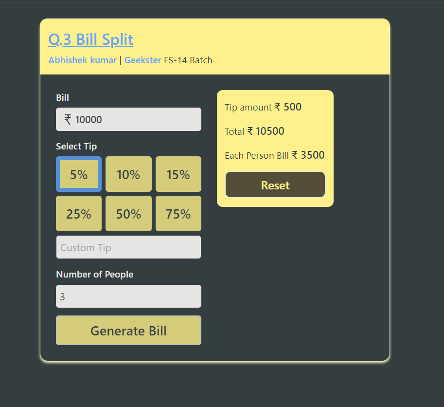

# 10 JS Task based Question | Geekster Placement Module #7

## Hosted Version of the Project:
[10 Solved JS Task based Questions by Abhishek kumar](https://alex21c.github.io/GeeksterPlacementModule-JSTaskBasedQuestion/)

## Tech. Stack Used:
+ [JavaScript ES6](https://en.wikipedia.org/wiki/JavaScript)
+ [HTML5](https://en.wikipedia.org/wiki/HTML5)
+ [CSS3](https://en.wikipedia.org/wiki/CSS)
+ [TailwindCSS](https://tailwindcss.com/)

## Author
[Abhishek kumar](https://www.linkedin.com/in/alex21c/), ([Geekster](https://geekster.in/) MERN Stack FS-14 Batch)

## Screenshots

